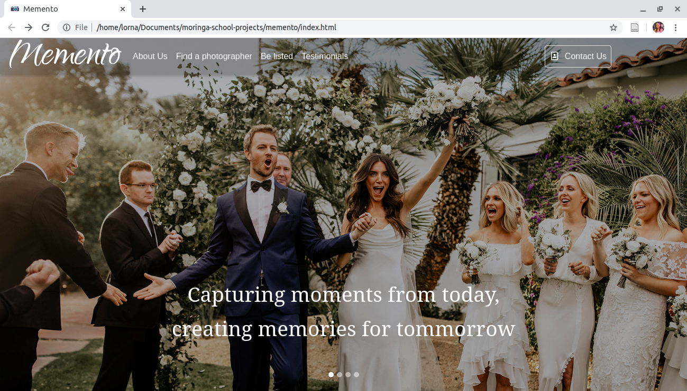

# Memento
#### A photography website for Memento, 22/04/2020
#### By [Lorna Kamau](https://github.com/lornakamau) , [Stacy Kiriiri](https://github.com/kiriiri) ,  [Allan Bosire](https://github.com/iAllan) , [David Kiptoo](https://github.com/cheptegei-create) and  [Hellen Kissinger](https://github.com/kissinger69)

## Description
This is a website for Memento, a photography website that understands the need for capturing moments and as such, fills in the gap of linking potential clients to as many event photographers as there possibly are. The page has 5 buttons in the navigation bar:
- About Us: allows potential customers to know more about the website.
- Find a photographer: potential clients go here to view profiles of listed photographers. The profiles contain the photographer's name, image, cost for services, contact details, a short description of themselves and a link to their portfolio.
- Be listed: photographers go here to sign up to get listed on the website. 
- Testimonials: this page contains testimonials of previous clients. All of whom express how grateful they are for the existence of a platform like Memento.
- Contact Us: this section contains Memento contact details and a feedback section.

## Need a photographer for an upcoming event?
Here's what you need to do:
- Visit the website at https://lornakamau.github.io/memento/
- Click on the "Find a Photographer" navigation button
- Select the event you need a photographer for and go through all the said event photographers' profiles
- Once you settle on one, click on the "Contact Me" link on their respective card to send them a booking email
- That was easy right? Be sure to recommend us to your friends and family!

## Are you a photographer who wants to put themselves out there? List with us!
Here's what you need to do:
- Visit the website at https://lornakamau.github.io/memento/
- Click on the "Be listed" navigation button
- Fill in the form details
- Congratulations! You have now been listed.
- Navigate back to the "Find a Photographer" button to see your profile under the event you listed for
- That was easy right? Be sure to recommend us to your colleagues!

## Development
To make advancements/modifications, follow these steps:

- Fork the repository
- Create a new branch (`git checkout -b improve-feature`)
- Make the appropriate changes in the files
- Add changes made
- Commit your changes (`git commit -am 'Improve feature'`)
- Push to the branch (`git push origin improve-feature`)
- Create a Pull Request 

## Known Bugs

There are no known bugs

## Technologies Used

While creating this website we used HTML, CSS, Javascript, Bootstrap and jQuery.

## Support and contact details

Should you be unable to access the website, have any recommendations or questions, feel free to email me:[kamaulorna@gmail.com](mailto:kamaulorna@gmail.com)

## To-do
1. Track all messages sent in the feedback section
2. Make use of localStorage to create photographer profiles
3. Make all pages responsive

## [License](https://github.com/lornakamau/memento/blob/master/LICENSE.md)

Copyright (c) 2020 [Lorna Kamau](https://github.com/lornakamau)  